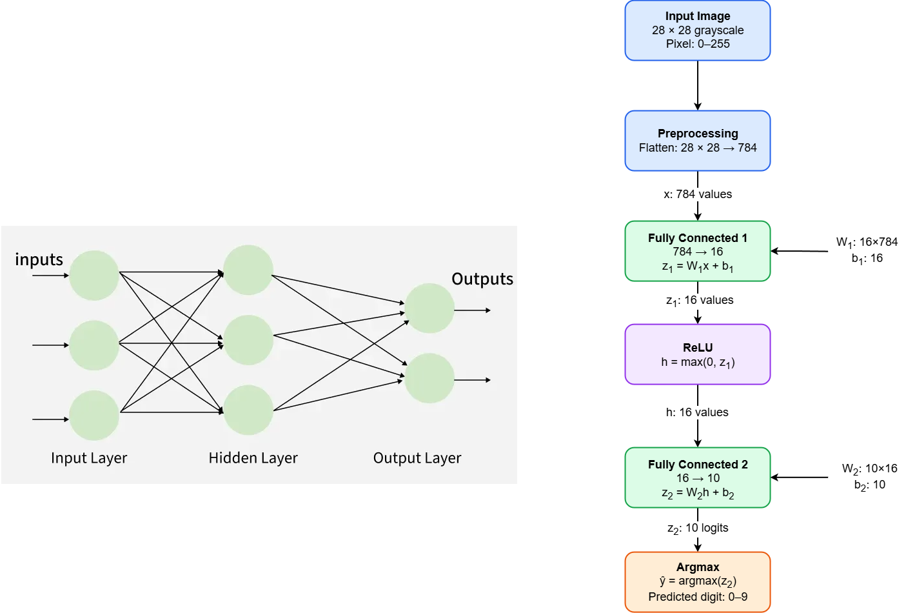

# MNIST MLP 784–16–10

Mô hình MLP nhận dạng chữ số viết tay MNIST

## Kiến trúc mô hình

```text
Ảnh grayscale 28×28
        ↓
Flatten row-major: 784 pixel
        ↓
Fully Connected 1: 784 → 16
        ↓
ReLU + Requantization
        ↓
Fully Connected 2: 16 → 10
        ↓
Argmax
        ↓
Chữ số dự đoán: 0–9
```



Mô hình có tổng cộng **12.730 tham số**:

- `W1`: 16 × 784
- `B1`: 16
- `W2`: 10 × 16
- `B2`: 10

## Kết quả

| Phiên bản | Accuracy trên 10.000 ảnh test |
|---|---:|
| Float PyTorch | 95,13% |
| Python integer | 95,04% |
| C integer | 95,04% |

- Mức giảm sau lượng tử hóa: **0,09 điểm phần trăm**
- Float/integer prediction agreement: **99,59%**
- C/Python mismatches: **0/10.000 ảnh**
- Calibration percentile: **99,5**
- FC1 requant multiplier: **435395**
- FC1 requant shift: **30**

## Kiểu dữ liệu integer

| Thành phần | Kiểu dữ liệu |
|---|---|
| Ảnh đầu vào | UINT8, miền 0–255 |
| W1, W2 | INT8 |
| B1, B2 | INT32 |
| FC1, FC2 accumulator | INT32 |
| Hidden activation | INT8, miền 0–127 |
| Tích requantization | INT64 |
| Logits | INT32 |

Input là một ảnh MNIST grayscale 28×28, được flatten theo thứ tự row-major thành 784 pixel UINT8.

## C inference

Source C đã xuất nằm trong [`outputs/c_run1`](outputs/c_run1):

- [`weights.h`](outputs/c_run1/weights.h): weight, bias và hệ số requantization
- [`inference.h`](outputs/c_run1/inference.h): khai báo hàm inference
- [`inference.c`](outputs/c_run1/inference.c): FC1, ReLU/requantization, FC2 và argmax
- [`main.c`](outputs/c_run1/main.c): chương trình kiểm tra
- [`test_vectors.h`](outputs/c_run1/test_vectors.h): 100 vector kiểm tra

Giao diện hàm:

```c
int mlp_infer(
    const uint8_t image[784],
    int32_t acc1[16],
    int8_t hidden[16],
    int32_t logits[10]
);
```

Hàm nhận một ảnh gồm 784 pixel và trả về chữ số dự đoán từ 0 đến 9.

## Biên dịch C test

Mở MSYS2 UCRT64 tại thư mục `training/outputs/c_run1`:

```bash
gcc -std=c99 -O2 -Wall -Wextra -Werror \
    inference.c main.c -o test_mlp.exe
```

Chạy:

```bash
./test_mlp.exe
```

Kết quả mong đợi:

```text
C/Python mismatches: 0
Label accuracy on these vectors: 98/100
PASS: C matches Python integer exactly on all supplied vectors.
```

Accuracy `98/100` chỉ thuộc bộ reference nhỏ. Accuracy integer chính thức trên toàn bộ 10.000 ảnh MNIST test là **95,04%**.

## Kiểm tra một ảnh MNIST

Tại thư mục `training`, chạy:

```powershell
.venv\Scripts\python.exe test_one_mnist.py --index 0
```

Ví dụ với ảnh test index 0:

```text
True label   : 7
C prediction : 7
Result       : CORRECT
```

## Các file chính

```text
training/
├── train_mlp.py
├── check_checkpoint.py
├── quantize_mlp.py
├── export_c.py
├── verify_full.py
├── test_one_mnist.py
├── docs/
│   └── MLP.drawio.png
└── outputs/
    ├── run1/
    ├── int8_run1/
    └── c_run1/
```

## Trạng thái

Đã hoàn thành:

- Train MLP 784–16–10
- Kiểm tra checkpoint float
- Post-training quantization
- Python integer inference
- Xuất `weights.h` và source C
- Kiểm tra C/Python trên toàn bộ 10.000 ảnh test
